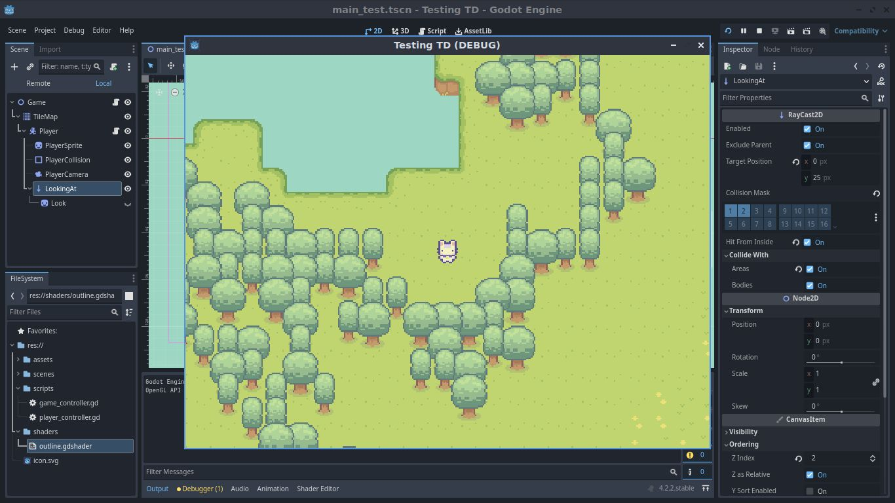

# Another-Sanbox-Game (WIP)
If anyone would like to contribute to the project, please feel free to do so. Feel free to report bugs or give feedback.

**The assets I am using are temporary, I will work on my own assets for the game later on.**

## Details:
* Engine: **Godot Engine 4.2.2**
* Features:
  1. Random world generation
  2. 8-directional player movement
  3. Interaction with trees (unfinished)
* Working on:
  1. Inventory
  2. Complete interaction with trees
  3. Other things

## Screenshots:

